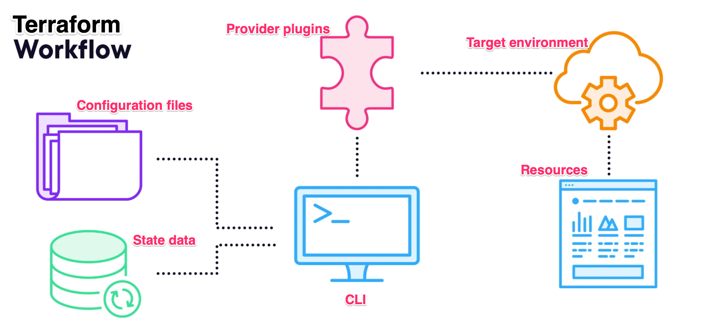

# Terraform

Terraform codifies cloud APIs into declarative configuration files. Infrastructure as Code (IaC), cloud provider
agnostic, standardization (security, compliance, cost management), scalable (self-service, CICD). 
Removes need for manual that might be error-prone processes.

- [docs](https://developer.hashicorp.com/terraform/docs)
- [cli docs](https://developer.hashicorp.com/terraform/cli)
    - `tenv`: Terraform environment manager
- [tutorials](https://developer.hashicorp.com/terraform/tutorials)
- [style guide](https://developer.hashicorp.com/terraform/language/style)
- [tests](https://developer.hashicorp.com/terraform/language/tests)

## Terraform workflow
- `terraform init`: pulls any provider plugins needed by the files, initializes a state data backend
  - `-upgrade`: to upgrade provider plugins
- `terraform fmt`: to format code
- `terraform validate`: to check syntax and logic
- `terraform plan`: diff between configuration and state data and makes a plan to update the target environment (can
  save output to a file)
  - `-out`: save plan to a file
  - `-replace`: mark a resource to be replaced regardless of its status (example: `-replace aws_instance.my_instance`)
    - useful when forcing a resource to be re-created
- `terraform apply`: make the changes in target environment
- `terraform destroy`: tear down everything in the target environment that terraform is managing based on the state data
- `terraform state`: manage state data
- `terraform workspace`: manage workspaces
- `terraform output`: show output values
- `terraform console`: interactive console to evaluate expressions and functions



## Providers

- Collection of resources and data sources, semantic versioned,
- Providers: https://registry.terraform.io/browse/providers
    - [AWS Provider](https://registry.terraform.io/providers/hashicorp/aws/latest/docs)
    - [JFrog Artifactory Provider](https://registry.terraform.io/providers/jfrog/artifactory/latest/docs)

## HCL: HashiCorp Configuration Language ".tf"

- Naming convention: snake_case

### Object types

- Providers: Info about the provider plugin (AWS, Dynatrace etc.)
- Resources: Things you want to create in the target environment (each resource is usually associated with a provider
  and will need some configuration) (EC2, DB, virtual network)
- Data sources: Way to query information from a provider (data to be used in the configuration), "read-only resource" (
  also associated with a provider).. (list of availability zones, ami for EC2 instance)

### Block syntax (JSON-like)

```terraform
block_type "label" "name_label" {
  key = "value"
  nested_block {
    key = "value"
  }
}
```

### Object reference

- Referencing declared objects in other places
- `self` reference to the current object

`<resource_type>.<name_label>.<attribute>` or `<resource_type>.<name_label>`

### Input and Output variables

- Input variables or just `variables` used to pass information to terraform at runtime (generating execution plan)
- Passing in `variables`:
    - CLI: `-var 'key=value'` or `-var-file='file.tfvars'`
    - File: `terraform.tfvars` or `*.auto.tfvars`
    - Environment variable: `TF_VAR_<key>`

```terraform
variable "name_label" {
  type        = value
  description = "string"
  default     = value
  sensitive   = true | false
  ....
}
variable "aws_regions" {
  type = list(string)
  default = ["us-east-1", "us-west-1"]
}
variable "aws_instance_sizes" {
  type = map(string)
  default = {
    small  = "t3.micro"
    medium = "m4.large"
  }
}

var.<name_label>
var.<name_label>[
<element_number>
]
var.<name_label>.<key_name> or var.<name_label>["<key_name>"
]
```

- Local values or just `locals` are **computed** values.
    - Internal to the configuration
    - Values with multiple references
    - Data transformation

```terraform
locals {
  name = "value"
  tags = {
    company      = "CompanyName"
    project      = var.project
    billing_code = var.billing_code
  }
}

local.<key>
```

- Output values returned by terraform (defined in configuration)
- `terraform output`

```terraform
output "name_label" {
  value       = value
  description = "string"
  sensitive   = true | false
}
```

### Terraform Data Types

- Primitive: string, number, bool
- Collection: list(\<type>), set, map(\<type>)
- Structural: tuple, object (difference vs. list/map is that the elements can be different)
- Any: list(any)
- Null

### Loops
- `count` meta argument (for resources or modules) - 0 or positive integer. `0` for conditional creation
  - `count.index` to reference the current index
  - `<resource_type>.<name_label>[element].<attribute>` - `aws_instance.web_servers[0].id` or `aws_instance.web_servers[*].id`
- `for_each` meta argument (for resources or modules) - map or set of strings. When resources could be significantly different
  - `each.key` and `each.value` to reference the current key and value (in list or set, `each.value` is the same as `each.key`)
  - `<resource_type>.<name_label>[key].<attribute>` - `aws_instance.web_servers["web1"].id`
    ```terraform
    resource "aws_instance" "web_servers" {
      for_each = {
        web1 = "t3.micro"
        web2 = "t3.small"
      }
      instance_type = each.value
    }
    ```
- `dynamic` block (for resources) - generate multiple nested blocks in a parent block
- `for` expressions - generate a list or map based off an existing one
  - filtering with `if` statements
  - result is a tuple or object
  ```terraform
    [ for item in items: tuple_element ]
    # [ for item in items: "New ${item}" ]
    [ for item in items: key => value ]
    [ for item in items: item if condition ]
    { for key, value in map: obj_key => obj_value }
  ```

### Expressions and Functions
- `terraform console`: interactive console to evaluate expressions and functions
- Expressions: Interpolation, arithmetic, logical, comparison, conditional, string, collection, type conversion, heredoc
- Functions: `Func_name(arg1, arg2, ...)` (arguments are not named, order matters)
  - [function docs](https://developer.hashicorp.com/terraform/language/functions) 
  - Common Function categories
    - numeric: `min`
    - string: `lower`
    - collection: `flatten`, `merge`, `zipmap`, `lookup`
    - IP network: `cidrhost`, `cidrsubnet`
    - Filesystem: `file`, `pathexpand`
    - Type conversion: `jsonencode`, `yamlencode`, `toset`

### Path expressions
Reference full paths: https://developer.hashicorp.com/terraform/language/expressions/references#filesystem-and-workspace-info
- `path.root`: root directory of the configuration
- `path.module`: directory of the module where the expression is evaluated
- `path.cwd`: current working directory where terraform is running (terraform cli)

### Modules
- Collection of terraform configuration files in a directory
- https://registry.terraform.io/browse/modules
- Reusable, shareable, self-contained packages of configuration: may have inputs, resources & data sources and outputs
  - Consider uniqueness of resources if module is called multiple times
- Hierarchical based on file structure (root > parent > child)
  - Any information needed by child module needs to be passed in through inputs and parent can only access outputs
  - Inputs and outputs are the contract / "interface" between modules
- Useful for:
  - Code organization
  - Reusability
  - Encapsulation
  - Versioning
- Source: local or remote (git, registry)
  - local: has to be a literal value, cannot use path expressions
- Inherit providers (although you can define a specific version of terraform or provider plugin)
- Useful to share common configuration / patterns in an organization

```terraform
module "name_label" { # descriptive name of the intent
  source = "local_or_remote"
  version = "version"
  providers = {
    provider_name = parent_provider_alias # optional, else would use the default provider
  }
  depends_on = [resource_type.name_label]
  # Input variable value: key = value
}
# parent module can reference output values: `module.name_label.output_name`
```

### Format and Validate

- `terraform fmt`: Formats code following HashiCorp's standard (IDE's can help automatically do this on save)
    - `-check`: to lint in CICD pipelines
    - `-recursive`
- `terraform validate`: Checks syntax and logic of configuration (needs init, does not check state)

## Terraform State

- Consistency between configuration and real-world resources, stores data (ex: unique identifiers) in state data
- Contents: Resources, data sources, modules, outputs, providers
- JSON format
- Planning
    - Refreshes on execution plan
    - Diff between configuration and state data
- Locking (concurrency)
    - Prevents multiple users from making changes at the same time
    - Locks the state file in the backend
- Location:
    - local file
    - remote backend (AWS S3, GCS, Azure Blob Storage, Consul, Terraform Cloud) - useful for collaboration and
      protection
- Workspaces: Isolation of state data (dev, test, prod) - multiple instances of the same configuration
- Commands
    - `terraform state list`: List all resources in state managed by Terraform
    - `terraform state show <resource_type>.<name_label>`: Show details of a resource in state
    - `terraform state mv <resource_type>.<name_label> <resource_type>.<new_name_label>`: Rename a resource in state
      - Useful when renaming a resource in configuration, but when terraform might recreate it from scratch and it takes too long/expensive
      - Or use `moved` block
    - `terraform state rm <resource_type>.<name_label>`: Remove a resource from state

## Terraform dependencies
- Implicit dependencies through references
- Explicit dependencies using `depends_on` meta-argument

## Terraform Post Deployment Configuration
- Resource: local file, mysql, kubernetes, helm providers
- Pass data: as startup script to OS, terraform doesn't know the intent, any changes will cause a redeploy
  - `user_data` in AWS
- Config management: Ansible, Chef, Puppet
- Bake AMI: Packer
- Provisioners: (usually considered last resort) defined as part of a resource, multiple provisions in the order they are defined
  - `null_resource` or `terraform_data`
  - `local-exec`: run a local command (where terraform is running)
  - `remote-exec`: run a command on a remote resource
  - `file`: create files/directories to a remote resource
