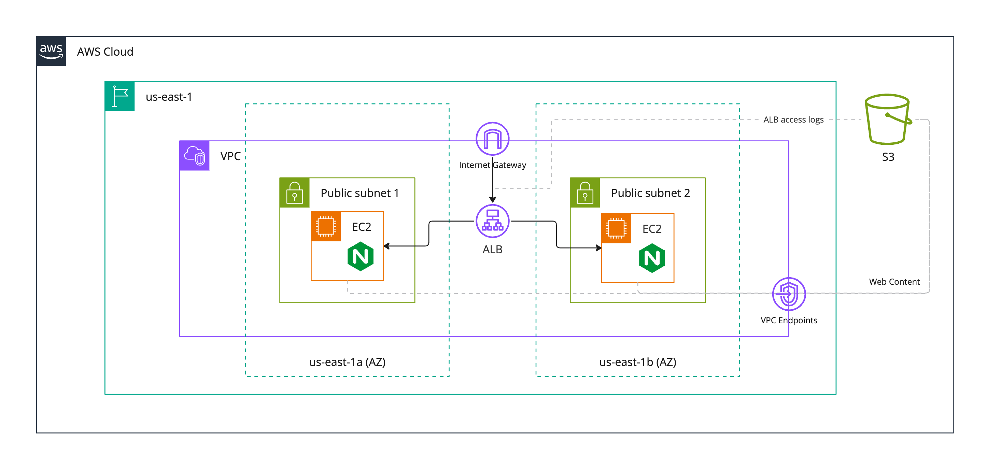
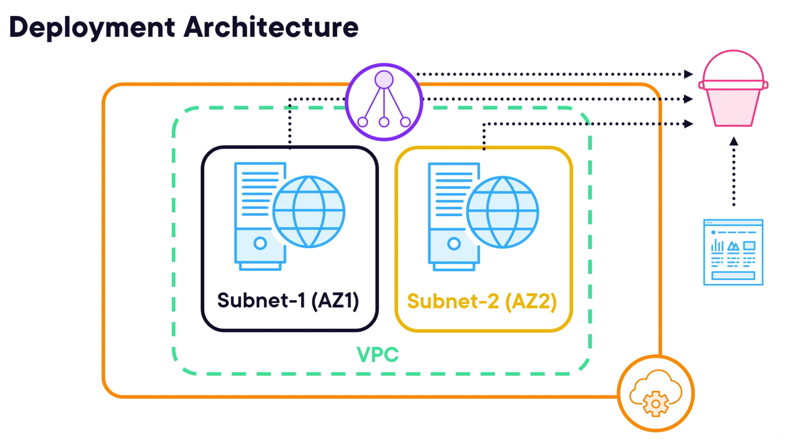

# Globomantics

## Terraform Configuration
- `terraform plan -var 'aws_access_key=<key>' -var 'aws_secret_key=<key>'`
- OR `TF_VAR_aws_access_key=<key> TF_VAR_aws_secret_key=<key> terraform plan`

## Deployment Architecture
- AWS cloud, 2 tier (web frontend and backend), VPC - subnet - EC2 instance running nginx, routing and security groups for web traffic, ALB

<!-- BEGIN_TF_DOCS -->
## Requirements

| Name | Version |
|------|---------|
|  [terraform](#requirement\_terraform) | >= 1.0 |
|  [aws](#requirement\_aws) | ~> 5.0 |
|  [random](#requirement\_random) | ~> 3.5.0 |

## Providers

| Name | Version |
|------|---------|
|  [aws](#provider\_aws) | 5.82.2 |
|  [random](#provider\_random) | 3.5.1 |

## Modules

| Name | Source | Version |
|------|--------|---------|
|  [app](#module\_app) | terraform-aws-modules/vpc/aws | 5.17.0 |
|  [webapp\_s3\_iam\_profile](#module\_webapp\_s3\_iam\_profile) | ./modules/globomantics-web-s3 | n/a |

## Resources

| Name | Type |
|------|------|
| [aws_instance.nginx_servers](https://registry.terraform.io/providers/hashicorp/aws/latest/docs/resources/instance) | resource |
| [aws_lb.nginx](https://registry.terraform.io/providers/hashicorp/aws/latest/docs/resources/lb) | resource |
| [aws_lb_listener.nginx](https://registry.terraform.io/providers/hashicorp/aws/latest/docs/resources/lb_listener) | resource |
| [aws_lb_target_group.nginx](https://registry.terraform.io/providers/hashicorp/aws/latest/docs/resources/lb_target_group) | resource |
| [aws_lb_target_group_attachment.nginx_servers](https://registry.terraform.io/providers/hashicorp/aws/latest/docs/resources/lb_target_group_attachment) | resource |
| [aws_s3_object.website_content](https://registry.terraform.io/providers/hashicorp/aws/latest/docs/resources/s3_object) | resource |
| [aws_security_group.alb_sg](https://registry.terraform.io/providers/hashicorp/aws/latest/docs/resources/security_group) | resource |
| [aws_security_group.nginx_sg](https://registry.terraform.io/providers/hashicorp/aws/latest/docs/resources/security_group) | resource |
| [random_integer.s3](https://registry.terraform.io/providers/hashicorp/random/latest/docs/resources/integer) | resource |
| [aws_ami.main](https://registry.terraform.io/providers/hashicorp/aws/latest/docs/data-sources/ami) | data source |
| [aws_availability_zones.available](https://registry.terraform.io/providers/hashicorp/aws/latest/docs/data-sources/availability_zones) | data source |
| [aws_elb_service_account.main](https://registry.terraform.io/providers/hashicorp/aws/latest/docs/data-sources/elb_service_account) | data source |
| [aws_region.current](https://registry.terraform.io/providers/hashicorp/aws/latest/docs/data-sources/region) | data source |

## Inputs

| Name | Description | Type | Default | Required |
|------|-------------|------|---------|:--------:|
|  [aws\_region](#input\_aws\_region) | Region to use for AWS resources | `string` | `"us-east-1"` | no |
|  [billing\_code](#input\_billing\_code) | Billing code for the project | `string` | n/a | yes |
|  [company\_name](#input\_company\_name) | Name of the company | `string` | `"Globomantics"` | no |
|  [environment](#input\_environment) | Environment to deploy the resources | `string` | `"dev"` | no |
|  [instance\_count](#input\_instance\_count) | Number of EC2 instances to create | `number` | `2` | no |
|  [instance\_type](#input\_instance\_type) | Instance type for the EC2 instance | `string` | `"t2.micro"` | no |
|  [naming\_prefix](#input\_naming\_prefix) | Prefix to use for naming resources | `string` | `"globo-web-app"` | no |
|  [project\_name](#input\_project\_name) | Name of the project | `string` | n/a | yes |
|  [security\_group\_egress\_port](#input\_security\_group\_egress\_port) | Port to allow ingress traffic | `number` | `0` | no |
|  [security\_group\_ingress\_port](#input\_security\_group\_ingress\_port) | Port to allow ingress traffic | `number` | `80` | no |
|  [vpc\_cidr\_block](#input\_vpc\_cidr\_block) | Base CIDR block for the VPC | `string` | `"10.0.0.0/16"` | no |
|  [vpc\_enable\_dns\_hostnames](#input\_vpc\_enable\_dns\_hostnames) | Enable DNS hostnames in the VPC | `bool` | `true` | no |
|  [vpc\_public\_subnet\_map\_public\_ip\_on\_launch](#input\_vpc\_public\_subnet\_map\_public\_ip\_on\_launch) | Map public IP on launch for the subnet | `bool` | `true` | no |
|  [vpc\_public\_subnets\_count](#input\_vpc\_public\_subnets\_count) | Number of public subnets to create | `number` | `2` | no |

## Outputs

| Name | Description |
|------|-------------|
|  [aws\_alb\_public\_dns](#output\_aws\_alb\_public\_dns) | Public DNS hostname for the application load balancer (ALB) |
<!-- END_TF_DOCS -->
